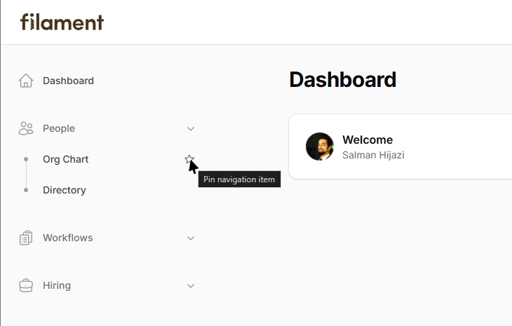
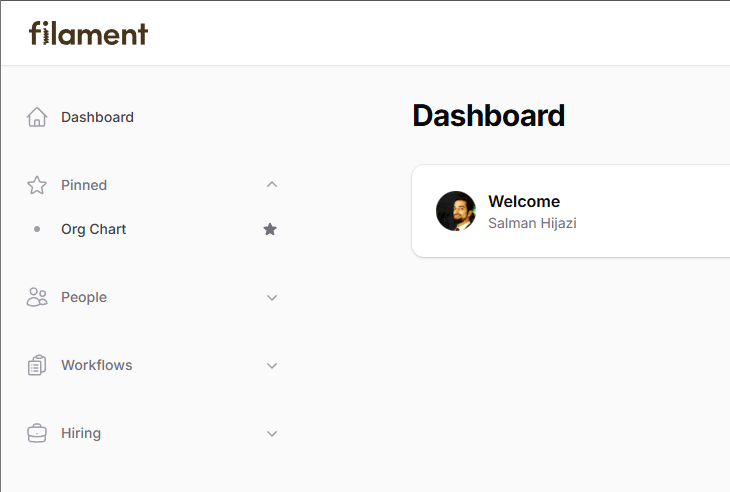
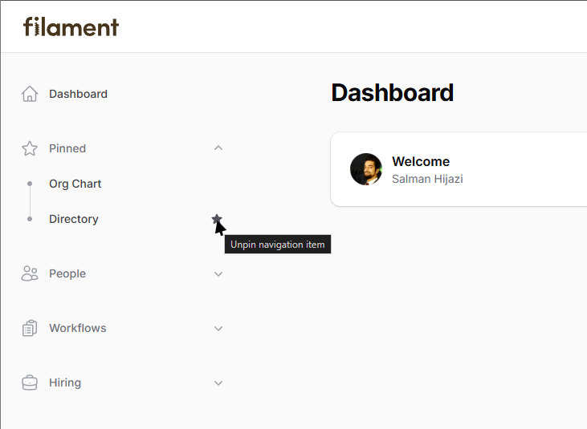

# Filament Pinnable Navigation

[](https://packagist.org/packages/devletes/filament-pinnable-navigation)
[](https://packagist.org/packages/devletes/filament-pinnable-navigation)
[](https://packagist.org/packages/devletes/filament-pinnable-navigation)
[](https://github.com/devletes/filament-pinnable-navigation/stargazers)

Allow users to dynamically pin sidebar navigation items to a pinned .

## Requirements

- PHP `^8.2`
- Filament `^5.0`

## Installation

```bash
composer require devletes/filament-pinnable-navigation
```

Register the plugin on any panel:

```php
use Devletes\FilamentPinnableNavigation\PinnableNavigationPlugin;
use Filament\Panel;

public function panel(Panel $panel): Panel
{
    return $panel
        ->default()
        ->id('admin')
        ->path('admin')
        ->plugin(PinnableNavigationPlugin::make());
}
```

## Configuration

Publish the config file if you want to customize behavior:

```bash
php artisan vendor:publish --tag="pinnable-navigation-config"
```

Default configuration:

```php
return [
    'database_enabled' => false,
    'table_name' => 'pinned_navigation_items',
    'group_title' => 'Pinned',
    'group_icon' => 'heroicon-o-star',
    'pin_icon' => 'heroicon-o-star',
    'unpin_icon' => 'heroicon-s-star',
    'show_in_resource' => true,
    'accordion_mode' => true,
];
```

Configuration options:

- `database_enabled`: Persist pins in the database instead of browser localStorage.
- `table_name`: Database table used when database persistence is enabled.
- `group_title`: Label used for the synthetic pinned group.
- `group_icon`: Optional icon shown for the pinned group.
- `pin_icon`: Icon used when an item is not pinned.
- `unpin_icon`: Icon used when an item is already pinned.
- `show_in_resource`: Show the page-header pin toggle on Filament resource index pages.
- `accordion_mode`: Keep only one managed navigation group open at a time. Disable it to fall back to Filament's default grouped navigation behavior.

## Persistence

By default, pin state is stored in browser localStorage per panel and authenticated user. No migration is required in this mode.

If you want to persist pins in the database instead:

1. Publish the config file.
2. Publish the package migrations.
3. Set `database_enabled` to `true`.
4. Run migrations.

```bash
php artisan vendor:publish --tag="pinnable-navigation-migrations"
php artisan migrate
```

## Usage

- Grouped navigation items can be pinned from the sidebar.
- When `show_in_resource` is enabled, the current resource page can also be pinned or unpinned from the page header.
- Pinned items are shown in a dedicated group at the top of the sidebar.

## Screenshots

### Pin navigation items from the sidebar



### Dedicated pinned group



### Multiple pinned items



## Credits

- [Salman Hijazi](https://www.linkedin.com/in/syedsalmanhijazi/)

## License

MIT. See [LICENSE.md](LICENSE.md).


